# A Pixelized Pokemon Game  

### IERG3080 Course Project II

#### 1. Overview

##### 1.1 Why Pixelmon (or Textmon)?

The Pokemon Game Series originated from the 1990s, with its prototype being Pokemon Red, which is a simple game running on GameBoy. Recently, a popular online game named Pokemon Go has redrawn considerable public attention, gained reputation form both game developers and game players.

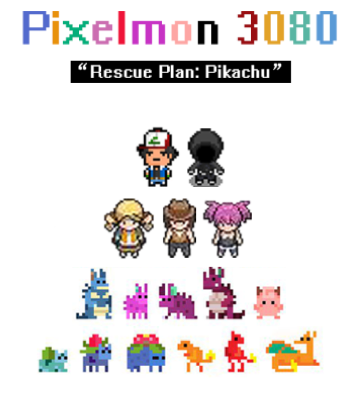

<i>Pixelized UI of Pixelmon</i>

Inspired by both the modern version **Pokemon Go** and the reminiscent version Pokemon Red, we came up with the idea called Pixelmon. Though running on modern PC, Pixelmon uses a pixelized UI, to create a similar experience as playing Pokemon Red in our childhood. Also, Pixelmon adopts many advanced features of Pokemon Go, with the game logic updated to the newest trend.  

If we trace back further into the game development history, we will find another game mode MUD, which is a bygone memory in the 1980s. **MUD** game doesn't have any graphical user interface. All of the information provided by the game and all of the instructions which the user might give is presented through pure text. In that way, the interaction between the user and the game is done by reading and typing. Here, we additionally create a prehistoric case of Pokemon: Textmon.  

In our graphical version, aka Pixelmon, several elementary features are essential for the main structure. To begin with, we need a **Navigation** System, which means a map of 2D. Then, we need to have some method for **Capturing** pixelmons, which would add new pixelmons to our collection. And we may need to check the status of the pixelmons, **Manage** our **Collections**. At last, we may need somewhere to bring our pixelmon into the battlefield, of which **Gym Battle** could be the best choice. Plus, some more features like **Story Line** can make our game more colorful and improve our user experience.

`"
1) Capture
2) Navigation
3) Gym Battle
4) Story Line (Extra Feature)
5) Collection Management
`"
The critical features of our text version, a.k.a. Textmon, are much easier to construct. Though the visual interface of our two versions shares nearly zero similarity, their inner game logic can be analogous in many perspectives. Based on the feature of Pixelmon, we can deduct the visual part and reuse many vital elements. In that way, our Textmon can be realized.

##### 1.3 Design Pattern: Abstract idea of MVP

To fulfill the requirement we have discussed above, we decide to adopt WPF for realization.
Considering the realization would not be small-scaled, and there will be more than one view or window to implement. MVP seems to be a preferable approach. Consider the similarity shared by these two versions and the lack of graphical UI in Textmon, we would like to concentrate on the MVP of the graphical version: Pixelmon. We discuss the simple design first, then adding more detailed features.

To allow the primary functions of Pixelmon to run properly, we need at least three classes: the Pokemon class, a Trainer class, and a Game class. The Pokemon class targets at single pixelmon, which contains each pixelmons' properties like CP, HP, and Skill. The Trainer class keeps a record of our player, contains properties like Name, Stardust (used to power up pixelmons), and Eggs (used to let pixelmon evolve). The Game class not only have one Trainer and many pixelmons (stored in some data structure), but also have some data and underlying logic of other game elements like map allocation and distribution.  

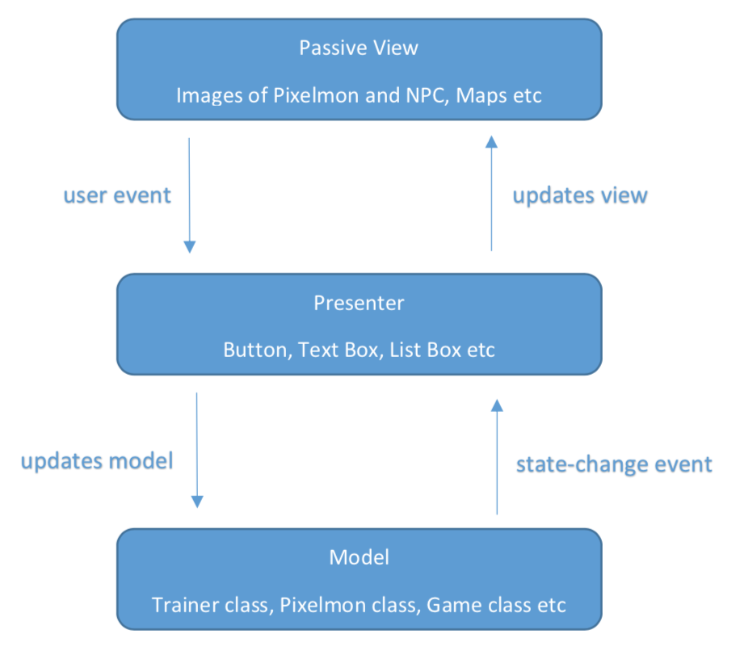
  

In the view part, we would like to see: the appearance of our pixelmon, the map, and some NPCs to tell our **Story Line**. Here we may have many inline pictures for each pixelmon and NPC, and separate the map into multiple square blocks, in which certain texture representing various terrain will fill.

In the presenter part, buttons, text boxes, and list boxes are applied for supervising control. To separate the view and model as thoroughly as possible, we use the presenter to change most of the view, and this view is regarded as a passive view.

The specification of the Real Game version Pixelmon will be covered in part 2 and 3, while the Text Mode version will be introduced separately in part 4.

#### 2. Design Conception: MVP

##### 2.1 Navigation  

**Model**: the model is purely a number matrix containing different numbers. Each number may mean different terrain on the map. For instance, when 0 means tree and 1 means grassland. A simple implementation could be of the following:  

`"
1 0 1 1 Grass Tree Grass Grass  
`"
**View**: Based on the model, the view can be implemented by the presenter, we only need to find each texture's picture and draw it on the canvas.  

**Presenter**: the presenter may contain four directions to go: upwards, downwards, leftwards, and rightwards. Each direction is presented by one button, and the related keys on the keyboard are bind in case using a keyboard.  

##### 2.2 Capture Window  

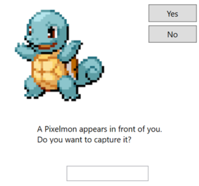

**Model**: Trainer class for adding newly captured pokemon and refreshing the pokemon list; Pokemon class for defining the properties of the captured pokemon.  

**View**: A canvas showing the picture of the pokemon; two buttons with one **Yes** and one **No** for players to decide whether to capture; two text blocks showing information about typing game; a textbox to input for the typing game; a message box telling the result of this capture.  

**Presenter**: mainly for controlling of typing game, which asks players to finish typing the name of this pokemon within a specific time, and updating the pokemon list of the Trainer class for players to add the captured pokemon if they succeed in typing. Details of the presenter will be introduced in **Realization of Requirements** part.  

##### 2.3 Gym-Battle Window

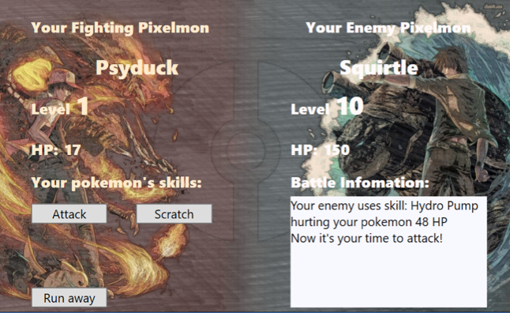
 

**Model**: Trainer class for updating the awards about the eggs and stardusts, which can be used to power up and evolve pokemon; Pokemon class for providing the information of name, skills, HP, and CP about the selected pokemon joining the battle.  

**View**: providing a new battle window with a battle background and a battle platform where the player can choose different methods of attacking of the pokemon to attack or give up the battle and run away; a text block is used to display the information of each round battle; a message box is used to show the result of the battle; a run_away button to allow the player leaving the battle in his/her round to attack when their fighting pokemon is still alive; one attack button to choose the normal attacking and four skill buttons to choose different, up to four special skills attacking.  

**Presenter**: mainly for controlling the battle and controlling updating the award information in Trainer class if the player wins the battle. Details of the presenter will be introduced in the Realization of Requirements part.

##### 2.4 Manage Pokemon/Collection

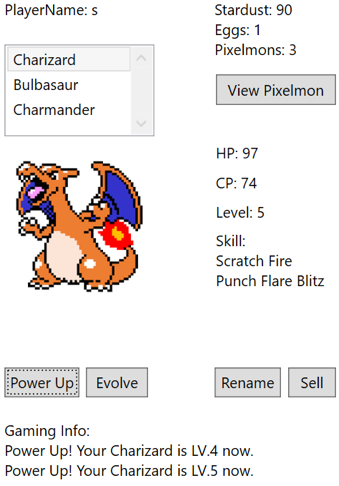
  

**Model**: The model is simply based on Trainer class and Pokemon class. The trainer class takes responsibility for the **Name**, **Stardust**, and **Eggs** while the Pokemon class takes responsibility for HP, CP, Skill, or Level.  

**View**: The view is decided by the presenter. After choosing a pixelmon and click **View Pixelmon**, a picture of the pixelmon will be presented. Plus, after Evolve, the view of the pixelmon changes too.  

**Presenter**: The presenter is composited of a list box and several buttons. The buttons take responsibility for **Evolve, Sell, Power Up, Rename, and View Pixelmon**. And the list box is used to choose a pixelmon.  

##### 2.5 Story (Bonus Feature)  

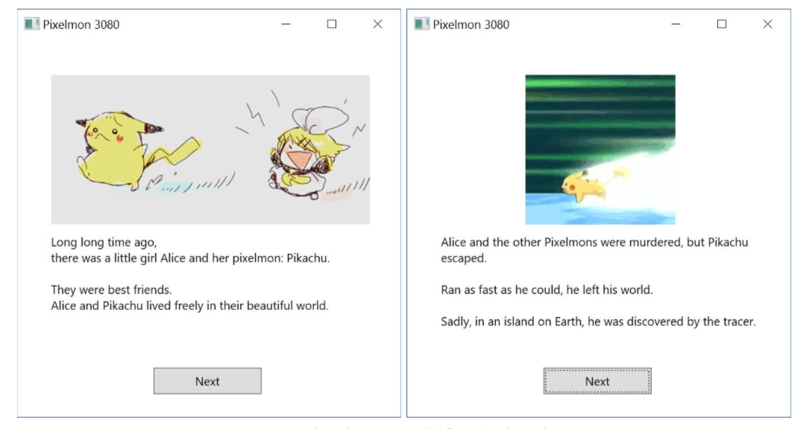
 

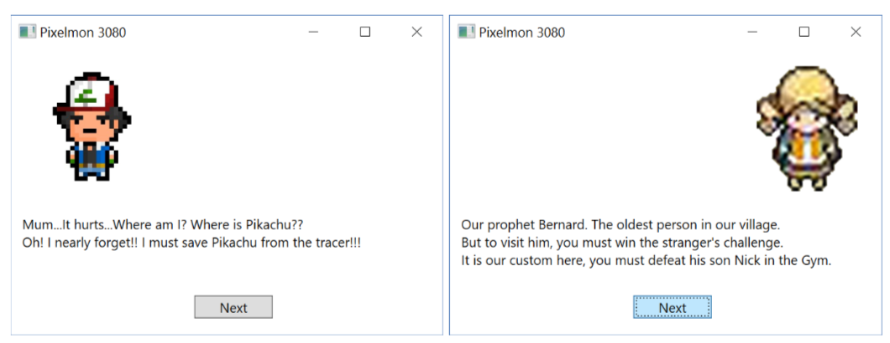

**Model**: The main model of the storyline is several tasks. Firstly, the player's final goal is to save Pikachu form the Bad Guy (as figure followed). But the island where the Bad Guy traps Pikachu is surrounded by some dark magic, where our character cannot enter (in our design, cannot enter means the final battle between the Bad Guy and our character won't be triggered unless all the previous Tasks has been accomplished). He must find the prophet **Bernard** to teach him how to break the dark magic.  

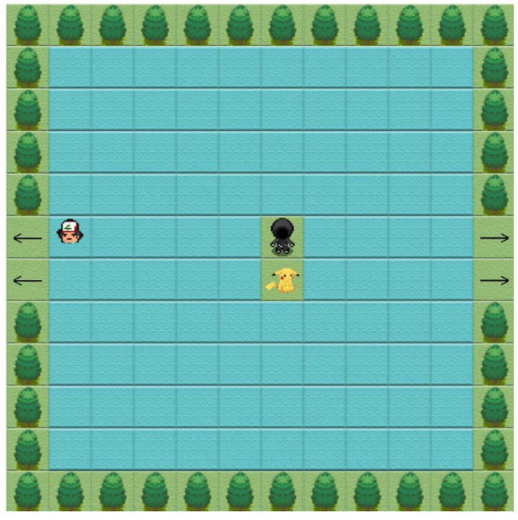

However, the way is not always smooth, and Bernard is not a guy who is easy to find. Our player
must finish the ** Stranger's Challenge **, which is one old custom in the village, after defending
Bernard's son Nick and the Guard, he can see Bernard.  

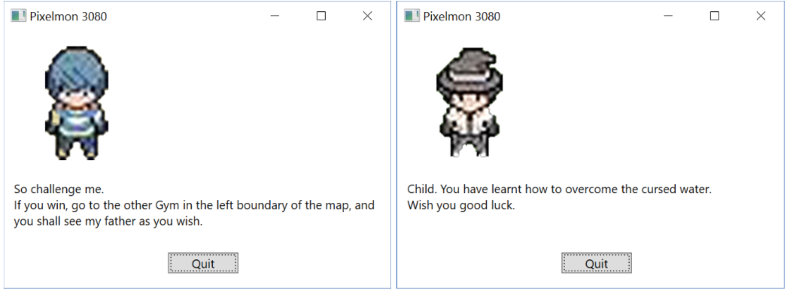

Bernard breaks the dark magic surrounding the island, now is the final battle.  

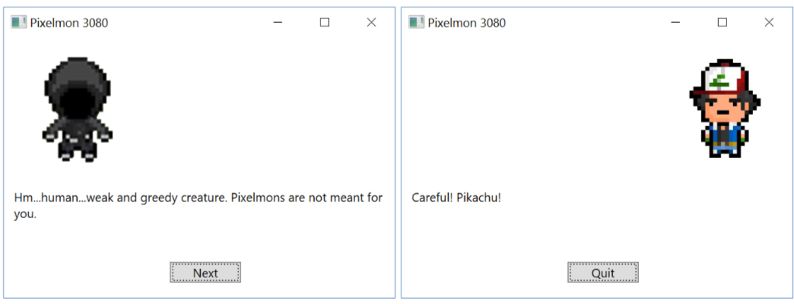

The **View** and **Presenter** is quite simple in StoryLine, so we will omit the detail.

#### 3. Realization of Requirements

##### 3.1 Navigation  

We have several data fields for realization like **BitmapList** to store the bitmaps, the **ImageList** to store the image, the **PokemonNameList** to store the name of pixelmons. When dealing with the map, we keep records of the X and Y coordinates where our player is, and we use NumberMatirxList to store the data of the map, and use **ImageMatrixList** to store the images in the map. In our current version, the total number of the map is three. We use an integer **CurrentMap** to tell which map our player is located.

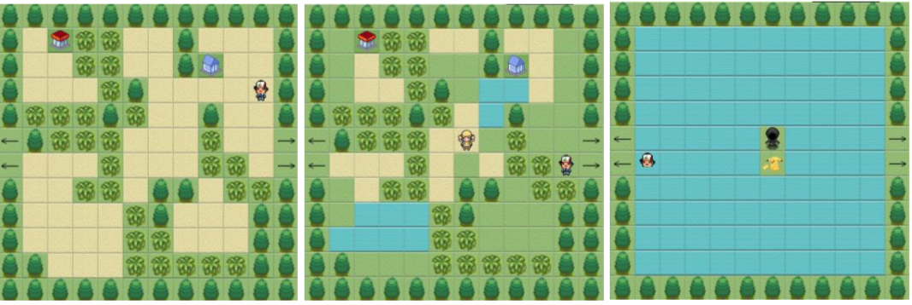

<i>Multiple Maps with Vairous Terrians</i>

##### 3.2 Capture

We select six grass boxes randomly located on our map to be the capture box where players have a chance to catch new pokemon. Players will not know exactly where the capture boxes are because these boxes are invisible to players so that they need to be explored by players.  

Once the player moves to one of these special boxes, which means that the player encounters a pokemon, the capture window will be triggered and ask the player whether he/she wants to capture this pokemon. If the player clicks button No, the **NoButton_Click** handler will be triggered, the window will be closed, and this pokemon will still remain in the map. If the player click button Yes, the **YesButton_Click** handler will be triggered, and a typing game will be shown at the bottom of the capture window that the typing content is the name of this pokemon. A tick method used here to count down the timer.   

A **typingbox_TextChanged** handler is used here to check the correctness of the user's input, which will be triggered every time the text is changed. If the player finishes typing before the timer is up, he/she will catch this pokemon with extra awards, and his/her pokemon list will be updated. Here we do not allow the player owning two pokemon with the same name so that the player needs to pay attention to this point and avoid the condition that not being able to catch new pokemon. We randomly choose capture boxes in the map by generating random numbers through each step the player moves so that any pokemon not being captured from a capture will remain in the map with another random-location box waiting for next capture.  

##### 3.3 Gym-Battle  

We set two kinds of gyms and three levels of bosses in the whole map for the need for our story. The first kind of gym has two gyms either with an evolved pokemon as a boss, and the second kind of gym also has two gyms either with a double-evolved pokemon as boss. All the property information of each pokemon garrisoning the gym will be input from outside. Every time the player wins the gym battle, he/she will get awards that can be used to power up or evolve their pokemon.  

The higher the level the boss is, the more awards will be given. The result of the gym battle will affect the showing of dialogue and may affect the pushing of the storyline. According to the storyline, we expect the player to challenge these gyms from easy one too hard one. However, it is ok for the player not to obey the storyline and to choose to challenge gyms randomly, and under this condition, there will be no clues being given for pushing the storyline no matter the player wins or losses. The last boss is the hardest one to beat with a much higher HP and much more powerful attacking than previous pokemon, which is also the end of this adventure. The battle is set as round-to-round, and during the computer pokemon attacking, the player cannot do any modification.  

A **timer** is used to count the round turning. Four **skill_Click** handlers control the use of up to four kinds of skill, and each button will disappear after being clicked so that every skill can only be used once. Compared to this, the **normalattack_click** handler controlling the normal attack can be triggered infinite times by clicking the **run away **button. All the battle information will be posted out at the text block after every round battle. The judgment of the result will be triggered by every button click. If the player wins, a **playerwin** method will be called to show a message box and give the player awards; else, a playerloss method will also be called to show a message box. And the most important thing is gyms will not disappear after battles, which means that players can train their pokemon all the time by winning the gym battle.  

#### 4. Difficulty Overcoming

##### 4.1 Memory Management:  

In our initial built of **Navigation**, each time the player moves, we use a new Image to cover the old one, in that way to simulate the movement of our character in memory. However, covering the old one means to add a new **Children** to **Canvas**, without deleting the old one. If we move our player rapidly on the map, the usage of memory will go up.  

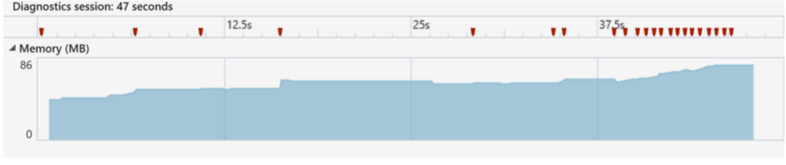

<i>The Memory Goes Up When Rapid Move</i>

To solve the problem, we create **ImageMatirxList** to store all the image shown in the canvas, when the player moves, we first traverse and delete the old image, then adding the new image as a new **Children** of the **Canvas**. In that way, we will always have a relatively small number of **Children** in **Canvas**, which reduces the required memory.  

##### 4.2 Animation Simulation  

In the **StoryLine**, we first want to adopt some encapsulated methods for our animation. However, we find that the **Image** in the **ToolBox** only supports GIF with **absolute address** but not **relative address**. In that case, we separate the GIF into frames, then display each frame, respectively.

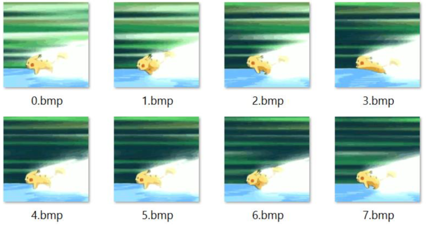
 

<i>Individual Frames of GIF</i>

##### 4.3 Passing Parameters Between Windows. 

At first, we initiate a new window and use Show() to display the window. However, we find that between several windows, we may need to pass some parameters like **PlayerName** and **PokemonName**. And we cannot always hold the window open. As a solution, we use **ShowDialogue()** instead of **Show()**, which allows us to pass parameters between windows.

##### 4.4 Global Class

During designing these two parts, the most challenging thing I have met is global sharing data.  

In the game, we need to share the same player's information stored in Trainer class, including the information about pokemon the player owns and the eggs and stardusts the player own. At first, we try to use the singleton, but it seems not to work because we still have to create a new instance in different windows, and the use of singleton bans us from doing that. After that, we try to use the navigation service to transfer the whole instance of the Trainer class and still failed.  

Then we decide to change the Trainer class into a static class and put it into the global class, and when every time we need it, we call it using **GlobalClass**. Finally, we use **Navigation** window as the central window transferring every filed and data we need from the custom constructor of different windows when it does navigation instead to solve this.

#### 5. Work Contribution

###### LIU YICUN

`"
*Coding Part: Navigation, StoryLine, and Management
*Class Structure Designing, Graphics
*Report Writing
`"
###### QI DI

`"
*Coding Part: Capture and GymBattle
*Report Writing
*Testing and Debugging
`"
